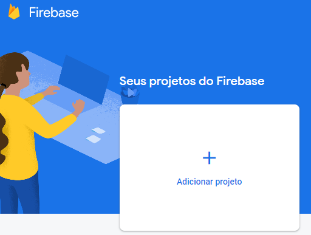
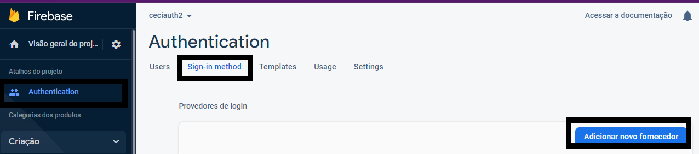
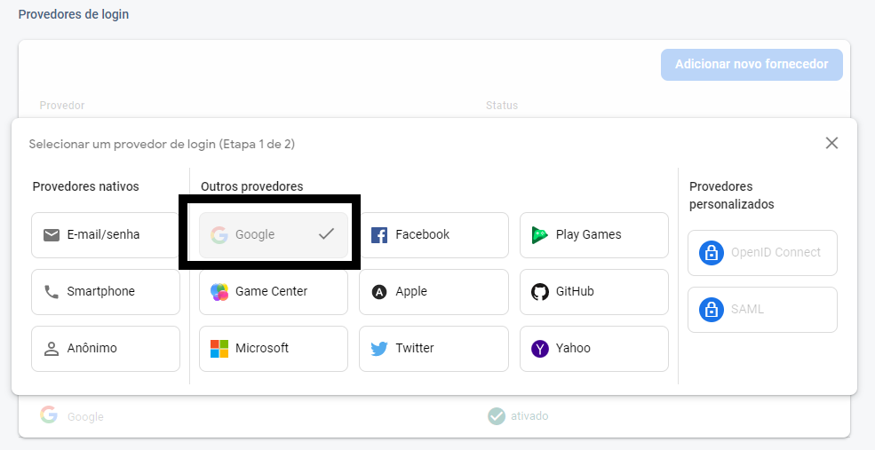
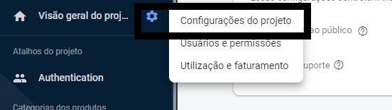
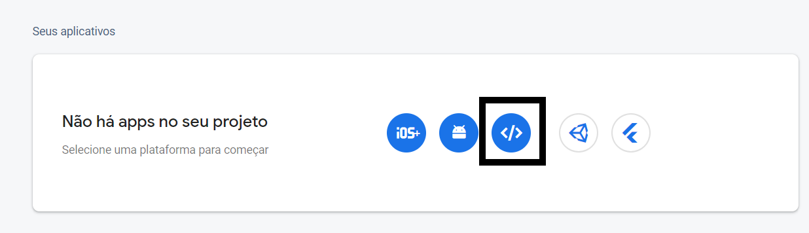
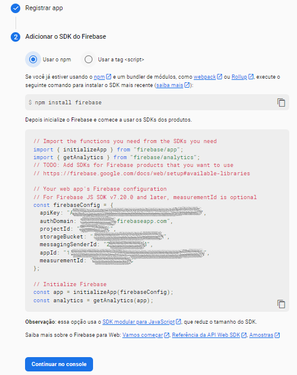
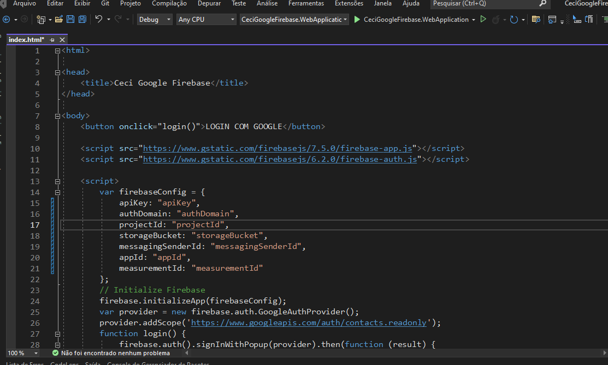
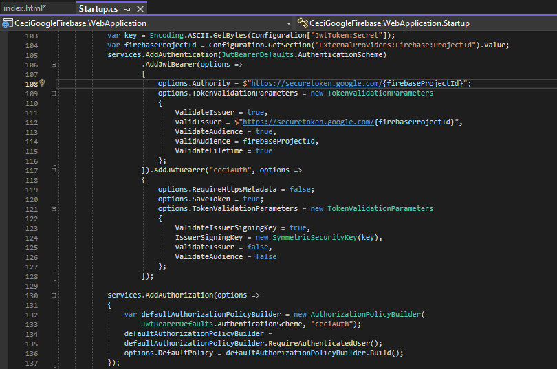

<h1 align="center"> Ceci Google Firebase </h1>

> Status do Projeto: Concluído :heavy_check_mark:

## Descrição do Projeto
<p align="justify"> O projeto Ceci Google Firebase é um projeto que possui arquitetura e funcionalidade básicas para o início de novos projetos contemplando autenticação com provedor externo do Google Firebase. </p>

## Navegar entre os tópicos
<!--ts-->
   * [Principais funcionalidades](#principais-funcionalidades)
   * [O que as funcionalidades do projeto é capaz de fazer](#o-que-as-funcionalidades-do-projeto-é-capaz-de-fazer-computer)
   * [Linguagens, libs e tecnologias utilizadas](#linguagens-libs-e-tecnologias-utilizadas-books)
   * [Como rodar a aplicação](#como-rodar-a-aplicação-arrow_forward)
      * [Clonando o projeto e instalando dependências](#clonando-o-projeto-e-instalando-dependências)
      * [Criando banco de dados com o Code First](#criando-banco-de-dados-com-o-code-first)
      * [Rodando a aplicação](#rodando-a-aplicação)
      * [Executando os testes](#executando-os-testes)
   * [Autenticação com o Google Firebase](#autenticação-com-o-google-firebase-lock)
   * [Publicação da API no Heroku](#publicação-da-api-no-heroku-rocket)
   * [Referências](#referências-newspaper)
<!--te-->

## Principais funcionalidades
- Autenticação
    - Autenticação de usuários com provedor externo Google Firebase
    - Autenticação de usuários por login e senha
- Usuário
    - Armazemamento persistente de usuários (criar, ler, atualizar e excluir)
- Endereço
    - Armazemamento persistente de endereços (criar, ler, atualizar e excluir)
- Perfil
    - Armazemamento persistente de perfil (criar, ler, atualizar e excluir)
- Relatórios
    - Importação e geração de relatórios em Excel

## O que as funcionalidades do projeto é capaz de fazer :computer:

:dart: Manter autenticação do usuário com base na autenticação do provedor externo Google Firebase 

:dart: Manter autenticação do usuário com base nos dados cadastrados, perfil e geração de token JWT 

:dart: Atualizar token de autenticação do usuário

:dart: Recuperar senha do usuário

:dart: Redefinir senha do usuário

:dart: Validar cadastro de novos usuários com a confirmação de um código enviado por email

:dart: Manter cadastro de usuários 

:dart: Manter perfis de usuários 

:dart: Vincular perfis a usuários 

:dart: Vincular endereços a usuários 

:dart: Execução de serviço em background (envio de emails e importação de relatórios)

:dart: Importação de dados de arquivo Excel para a base de dados

:dart: Geração de relatórios em excel com base em filtros enviados na requisição

## Linguagens, libs e tecnologias utilizadas :books:

- [.NET Core](https://dotnet.microsoft.com/en-us/download/dotnet/6.0): versão 6.0
    - Plataforma de desenvolvimento gratuita e de software livre para a criação de muitos tipos de aplicativos.
- [C#](https://docs.microsoft.com/pt-br/dotnet/csharp/): versão 8.0
    - Linguagem de programação moderna, orientada a objeto e fortemente digitada.
- [Hangfire](https://www.hangfire.io/): versão 1.7
    - Biblioteca que permite realizar o processamento em segundo plano em aplicativos .NET e .NET Core.
- [Bogus](https://github.com/bchavez/Bogus): versão 34.0.2
    - Gerador de dados falsos simples e lógico para linguagens .NET como C # , F # e VB.NET . 
- [Moq](https://github.com/moq): versão 4.17.2
    - Biblioteca de simulação para .NET 
- [Swashbuckle.AspNetCore](https://github.com/domaindrivendev/Swashbuckle.AspNetCore): versão 6.3.1
    - Conjunto de ferramentas Swagger para APIs criadas com ASP.NET Core. Gere uma bela documentação de API, incluindo uma IU para explorar e testar operações, diretamente de suas rotas, controladores e modelos.
- [AutoMapper](https://github.com/AutoMapper/AutoMapper): versão 11.0.1
    - Um mapeador de objeto-objeto baseado em convenção em .NET.
- [FluentValidation](https://fluentvalidation.net/): versão 10.4.0
    - Biblioteca de validação para .NET que usa uma interface fluente e expressões lambda para construir regras de validação fortemente tipadas.
- [Pomelo.EntityFrameworkCore.MySql](https://github.com/PomeloFoundation/Pomelo.EntityFrameworkCore.MySql): versão 6.0.1
    - Provedor Entity Framework Core mais popular para bancos de dados compatíveis com MySQL. Ele oferece suporte ao EF Core até sua versão mais recente e usa MySqlConnector para comunicação de servidor de banco de dados de alto desempenho.
- [ClosedXML](https://github.com/ClosedXML/ClosedXML): versão 0.95.4
    - ClosedXML é uma biblioteca .NET para leitura, manipulação e gravação de arquivos Excel 2007+ (.xlsx, .xlsm). Ele visa fornecer uma interface intuitiva e amigável para lidar com a API OpenXML subjacente.
	
## Como rodar a aplicação :arrow_forward:

### Clonando o projeto e instalando dependências

No terminal, clone o projeto: 

```
git clone https://github.com/pablofsilva91/CeciGoogleFirebase.git
```

### Configurações do aplicativo

Antes de rodar a aplicação, é necessário definir os valores no arquivo de configuração do projeto WebApplication. Navegue até a raiz do projeto e acesse o arquivo "appSettings.Development.json" e adicione os valores para as chaves. Os valores apresentados dentro de colchetes ([]) são os valores que devem ser alterados: 

**Banco de dados**

Nessa seção, deve ser inserido as configurações do banco de dados.

```
"ConnectionStrings": {
    "CeciDatabase": "server=[NOME-SERVER-BANCO];uid=[NOME-USUARIO-BANCO];pwd=[SENHA-USUARIO-BANCO];database=[NOME-BANCO];persistsecurityinfo=True;Allow User Variables=True",
    "HangfireDb": "server=[NOME-SERVER-BANCO];uid=[NOME-USUARIO-BANCO];pwd=[SENHA-USUARIO-BANCO];database=[NOME-BANCO];persistsecurityinfo=True;Allow User Variables=True"
  }
```
**Token JWT**

Deve ser criado uma chave secreta e inserido nessa seção, ela será utilizada para gerar o token jwt e validar o token enviado nas requisições de autenticação.

```
"JwtToken": {
    "Secret": "[SECRET-KEY-JWT-TOKEN]"
  }
```
**Swagger**

Nessa seção, deve ser definido as credenciais para acesso ao swagger da nossa aplicação.

```
"SwaggerSettings": {
    "SwaggerUserAuthorized": "[SWAGGER-USUARIO-AUTORIZADO]",
    "SwaggerAuthorizedPassword": "[SWAGGER-SENHA-USUARIO-AUTORIZADO]"
  }
```
**Email**

Nessa seção, deve ser inserido as configurações de email. Deve conter informações de uma caixa de email válida, pois essa será a caixa de email responsável para o envio de email nos fluxos contemplados por essa ação.

```
"EmailSettings": {
    "Mail": "[ENDERECO-EMAIL-PARA-ENVIO]",
    "DisplayName": "[NOME-REMETENTE]",
    "Password": "[SENHA-EMAIL]",
    "Host": "[HOST]", //Exemplos: "smtp.office365.com", "smtp.gmail.com" 
    "Port": [PORTA]
  }
```
**Perfil**

O valor para a chave "BasicRoleName" contida na seção "RoleSettings" deve ser o nome do perfil que será utilizado como "Básico" ou o perfil com nível mais baixo. Para o correto funcionamento da versão atual o valor para a chave está definida como "basic".

```
"RoleSettings": {
    "BasicRoleName": "basic"
  }
```
**Hangfire**

Nessa seção, deve ser definido as credenciais para acesso ao dashboard do hangfire, que é o serviço responsável pela execução das tarefas em background.

```
"HangfireSettings": {
    "HangfireUserAuthorized": "[HANGFIRE-USUARIO-AUTORIZADO]",
    "HangfireAuthorizedPassword": "[HANGFIRE-SENHA-USUARIO-AUTORIZADO]"
  }
```
**Serviços externos**

Os valores para as chaves apresentadas na seção "ExternalProviders" são para utilização dos serviços do SendGrid e Firebase e os seus valores são obtidos no momento do cadastro desses serviços.

```
 "ExternalProviders": {
    "SendGrid": {
      "ApiKey": "[SEND-GRID-API-KEY]",
      "SenderEmail": "[EMAIL]",
      "SenderName": "NoReply"
    },
    "Firebase": {
      "ServerApiKey": "[FIREBASE-API-KEY]",
      "SenderId": "[FIREBASE-SENDER-ID]",
      "ProjectId": "[FIREBASE-PROJECT-ID]"
    }
  }
```
### Build

Após clonado, navegue até a raiz do projeto e execute o comando "dotnet build" para compilar o projeto e suas dependências:

```
PS ...\Ceci> dotnet build
```

### Criando banco de dados com o Code First

Code First permite que você defina seu modelo usando C# ou VB.Net classes. 
Para a a migração das classe com o code first, um novo banco de dados deve ser criado. 
Nesse projeto foi criado um novo banco de dados "ceci" utilizando o serviço de banco de dados MySql. 
Para a execução dos comandos as configurações do banco de dados devem ser definidas na seção "ConnectionStrings" no arquivo appsettings.  

```
  "ConnectionStrings": {
    "CeciDatabase": "server=localhost;uid=root;pwd=root;database=ceci;persistsecurityinfo=True"
  }
```

Com o banco de dados criado e as configurações definidas, pode ser utilizado no terminal o comando para adicionar a migração inicial das classes de entidades.
O projeto já possui a migração inicial realizada, então existem duas formas de criar as tabelas no banco de dados para esse projeto:

1. Criando tabelas com a migração inicial do projeto

    Uma vez que o projeto possua a migração inicial já implementada, basta realizar o update na base de dados com o comando "dotnet ef database update".
    Por conta da estrutura do projeto é necessário especificar em qual projeto está a classe de contexto e qual é o projeto de inicialização:

    ```
    dotnet ef database update --project CeciGoogleFirebase.Infra.Data --startup-project CeciGoogleFirebase.WebApplication
    ```

    Além de criar o modelo de dados, essa migração inicial também irá criar os registros de perfil (basic e administrator) e um usuário vinculado ao perfil "administrator". O perfil desse usuário dará permissão para acesso a funcionalidades que exigem esse perfil, uma vez que para acesso a controllers que possuem a política "Administrator" faz-se necessário que o usuário tenha perfil "administrator".

    As senhas dos usuários devem ser convertidas para o formato base64 que é necessário para a realização da criptografia. É realizado uma criptografia da senha antes do armazenamento do registro e também a descriptografia no momento da validação do usuário, ou seja, tanto para o cadastro quanto para o login na aplicação, a senha deve ser convertida para base64 antes do envio.

    Dados do usuário registrado pelo code first:

    Email: admin@email.com

    Password: YWRtaW4= (base64 "admin" = "YWRtaW4=")

2. Realizar a migração do zero

    Para criar a migração inicial do zero, é necessário excluir a pasta "Migrations" que consta no projeto "CeciGoogleFirebase.Infra.Data". A nova migração pode ser criada com o comando "dotnet ef migrations add [NOME_MIGRACAO]". Por conta da estrutura do projeto é necessário especificar em qual projeto está a classe de contexto e qual é o projeto de inicialização:

    ```
    dotnet ef migrations add InitialMigration --project CeciGoogleFirebase.Infra.Data --startup-project CeciGoogleFirebase.WebApplication
    ```

    Diferente da criação das tabelas aproveitando a migração já implementada no projeto, essa migração não criará os perfis básicos necessários para o controle de autenticação do projeto e nem o usuário inicial. Esses registros podem ser realizados de forma manual ou pode ser adicionado aproveitando a migração inicial, para isso, adicione esse código no final do método "Up" que consta na classe de migração ("InitialMigration" ou o nome que foi definido na execução do comando) que foi criado após a execução do comando "dotnet ef migrations add":

    ```
           migrationBuilder.InsertData(
                table: "Role",
                columns: new[] { "Active", 
                    "RegistrationDate", 
                    "Name" },
                values: new object[,]
                {
                    { true, DateTime.Now, "administrator" },
                    { true, DateTime.Now, "basic" }
                });

            migrationBuilder.InsertData(
                table: "User",
                columns: new[] { "Active",
                                "RegistrationDate",
                                "Name",
                                "Email",
                                "Password",
                                "RoleId",
                                "Validated",
                                "ChangePassword" },
                values: new object[,]
                {
                    { true,
                        DateTime.Now,
                        "Administrator",
                        "admin@email.com",
                        PasswordExtension.EncryptPassword("YWRtaW4="), /*Generate a new encrypted password for the base64 encoded "admin" value (base64 admin = YWRtaW4=)*/
                        1 /*role Administrator*/,
                        true,
                        false},
                });
    ```

    Como apresentado no código acima e também explicado na opção de criação das tabelas aproveitando a migração já implementada, as senhas dos usuários devem ser convertidas para o formato base64 que é necessário para a realização da criptografia. É realizado uma criptografia da senha antes do armazenamento do registro e também a descriptografia no momento da validação do usuário, ou seja tanto para o cadastro quanto para o login na aplicação, a senha deve ser convertida para base64 antes do envio.

    Concluída a etapa de adicionar a migração, executar o comando "dotnet ef database update" para atualizar a base de dados:

    ```
    dotnet ef database update --project CeciGoogleFirebase.Infra.Data --startup-project CeciGoogleFirebase.WebApplication
    ```

**Alterações nas entidades**

Para novas alterações nas entidades, pode ser executado o comando "dotnet ef migrations add [NOME_MIGRACAO]", que vai adicionar em uma nova migração com as alterações realizadas:

```
dotnet ef migrations add [NOME_MIGRACAO] --project CeciGoogleFirebase.Infra.Data --startup-project CeciGoogleFirebase.WebApplication
```

Após a criação da migração, executar o comando para atualizar a base de dados:

```
dotnet ef database update --project CeciGoogleFirebase.Infra.Data --startup-project CeciGoogleFirebase.WebApplication
```

### Rodando a aplicação

Navegue até o projeto WebApplication "CeciGoogleFirebase.WebApplication" e execute o comando "dotnet run": 

```
PS ...\CeciGoogleFirebase\CeciGoogleFirebase.WebApplication> dotnet run
```

O endereço da aplicação ficará disponível no console. Com a URL identificada é possível realizar um teste acessando o swagger da aplicação:

```
https://localhost:[PORTA]/swagger
```

As credenciais para logar e visualizar o swagger estão definidas na seção "SwaggerSettings" no arquivo appsettings.json. Essas credenciais podem ser alteradas ou até mesmo o login ser removido, o conteúdo de apoio para a implementação da funcionalidade pode ser visualizado no tópico Swagger na listagem de Referências [Restrict access to swagger](https://github.com/domaindrivendev/Swashbuckle.WebApi/issues/384#issuecomment-410117400).

### Executando os testes

Navegue até o projeto de testes "CeciGoogleFirebase.Test" e execute o comando "dotnet test": 

```
PS ...\CeciGoogleFirebase\CeciGoogleFirebase.Test> dotnet test
```

O resultado dos testes aparecerá no console.

## Autenticação com o Google Firebase :lock:

Para a autenticação com o Google Firebase, primeirameente precisamos criar um projeto no Firebase. Acesse: https://console.firebase.google.com/ e clique na opção "Adicionar projeto"

<div align="center">
     
</div>

Após a criação do projeto, navegue até a opção Authentication e na opção "Sign-in method" acione o botão "Adicionar novo fornecedor" para habilitar o provedor do Google:

<div align="center">
     
</div>
<br>
<div align="center">
     
</div>

Uma vez habilitado o provedor do Google, navegue até as configurações do projeto e na seção "Seus aplicativos" adicione uma nova aplicação, nesse projeto iremos utilizar a opção WEB:

<div align="center">
     
</div>
<br>
<div align="center">
     
</div>

Finalize o registro do app e guarde o código que vai ser disponibilizado para podermos adicionar nas configurações do projeto front-end e na API:

<div align="center">
     
</div>

Na solução, dentro do projeto WebAppliation contém a pasta Client, que possue o html responsável por disponibilizar a modal de autenticação com o Google. Nesse arquivo você deve substituir as informações de configuração pelas informações recém geradas ao registrar o seu app no Firebase:

<div align="center">
     
</div>

Estando configurado o front, é necessário ajustar também backend. No arquivo Startup é necessário configurar a autenticação, no projeto contém uma autenticação personalizada, chamada de "ceciAuth", e também a opção de autenticação com o Google Firebase, para isso é preciso adicionar as duas formas de autenticação no "AddAuthentication" e informar para o "AddAuthorization" as políticas que serão utilizadas na API:

<div align="center">
     
</div>

Para testar, execute o projeto API e a página html para que seja exibida a opção de autenticação do Google. A página web pode ser iniciada executando os seguintes comandos:

npm install -g http-server

http-server -c1

O token vai ser disponibilizado no console, e o teste pode ser validado ao executar qualque método de uma controller que possua o atributo [Authorize].

## Publicação da API no Heroku :rocket:

A Heroku é uma plataforma em nuvem que permite que as empresas criem, entreguem, monitorem e dimensionem aplicativos. A plataforma possui um plano gratuito para aplicativos não comerciais, como prova de conceito, MVP e projetos pessoais, ou seja, é uma excelente ferramente para testar a nossa API. 

A publicação na plataforma Heroku foi realizada com base no artigo [Deploy de uma aplicação .NET Core 3.0 + Docker no Heroku](https://medium.com/@lorranpalmeira/deploy-de-uma-aplica%C3%A7%C3%A3o-net-core-3-0-docker-no-heroku-481c21f8d3c5), que é bem prático e objetivo, do autor [Lorran, C# Developer](https://medium.com/@lorranpalmeira). Apesar de no artigo ser utilizado como base uma versão 3.0 .NET Core, o conteúdo pode ser utilizado para a publicação da versão 6.0 .NET Core.

O arquivo "DockerFile", já está contemplado nessa versão e está disponível na raiz da solução, em alguns casos o arquivo é armazenado na raiz do projeto WebApplication, mais como o projeto Ceci possui mais de um projeto na solução e são dependências de projetos, a publicação no Heroku só foi concluída com essa organização. Vale ressaltar que essa foi uma configuração na qual foi possível publicar o projeto Ceci no Heroku, não necessáriamente é uma regra para o caminho do arquivo "DockerFile".

## Referências :newspaper:

Os seguintes artigos, documentações e exemplos foram utilizados como material de apoio para a implementação do projeto:

### Arquitetura

- https://alexalvess.medium.com/criando-uma-api-em-net-core-baseado-na-arquitetura-ddd-2c6a409c686
- http://www.macoratti.net/18/12/netcore_repo1.htm
- http://www.linhadecodigo.com.br/artigo/3370/entity-framework-4-repositorio-generico.aspx
- https://medium.com/imaginelearning/asp-net-core-3-1-microservice-quick-start-c0c2f4d6c7fa
- https://pradeeploganathan.com/architecture/repository-and-unit-of-work-pattern-asp-net-core-3-1/

### Validações e regras de negócio

- https://docs.fluentvalidation.net/en/latest/aspnet.html
- https://stackoverflow.com/questions/40275195/how-to-set-up-automapper-in-asp-net-core/40275196#40275196
- https://desenvolvedor.ninja/dica-validacao-de-cpf-e-cnpj-no-c/

### Autenticação

- https://jasonwatmore.com/post/2020/05/25/aspnet-core-3-api-jwt-authentication-with-refresh-tokens
- https://stackoverflow.com/questions/10168240/encrypting-decrypting-a-string-in-c-sharp
- https://balta.io/artigos/aspnetcore-3-autenticacao-autorizacao-bearer-jwt
- https://www.red-gate.com/simple-talk/development/dotnet-development/policy-based-authorization-in-asp-net-core-a-deep-dive/
- https://balta.io/blog/aspnetcore-3-1-autenticando-sua-api-com-google-via-firebase

### Envio de email

- https://www.ryadel.com/en/asp-net-core-send-email-messages-sendgrid-api/
- http://www.macoratti.net/20/08/aspnc_email1.htm

### Execução em background

- https://andyp.dev/posts/hangfire-mysql-asp-net
- https://docs.hangfire.io/en/latest/getting-started/aspnet-core-applications.html
- https://docs.hangfire.io/en/latest/background-methods/writing-unit-tests.html

### Testes

- http://www.macoratti.net/19/10/cshp_unitestmoq1.htm
- https://www.c-sharpcorner.com/article/unit-testing-using-xunit-and-moq-in-asp-net-core/
- https://nelson-souza.medium.com/net-core-fake-data-442fed37718d
- https://code-maze.com/unit-testing-controllers-aspnetcore-moq/

### Swagger

- https://www.c-sharpcorner.com/article/asp-net-core-3-1-web-api-and-swagger/
- https://github.com/domaindrivendev/Swashbuckle.WebApi/issues/384#issuecomment-410117400
- https://stackoverflow.com/a/58972781/9831049

### Importação e manipulação de arquivos

- https://closedxml.readthedocs.io/en/latest/simpleWorkbookExample.html#creating-a-workbook

### Publicação Heroku e Docker

- https://medium.com/@lorranpalmeira/deploy-de-uma-aplica%C3%A7%C3%A3o-net-core-3-0-docker-no-heroku-481c21f8d3c5

### Documentação

- https://dev.to/reginadiana/como-escrever-um-readme-md-sensacional-no-github-4509
- https://blog.rocketseat.com.br/como-fazer-um-bom-readme/